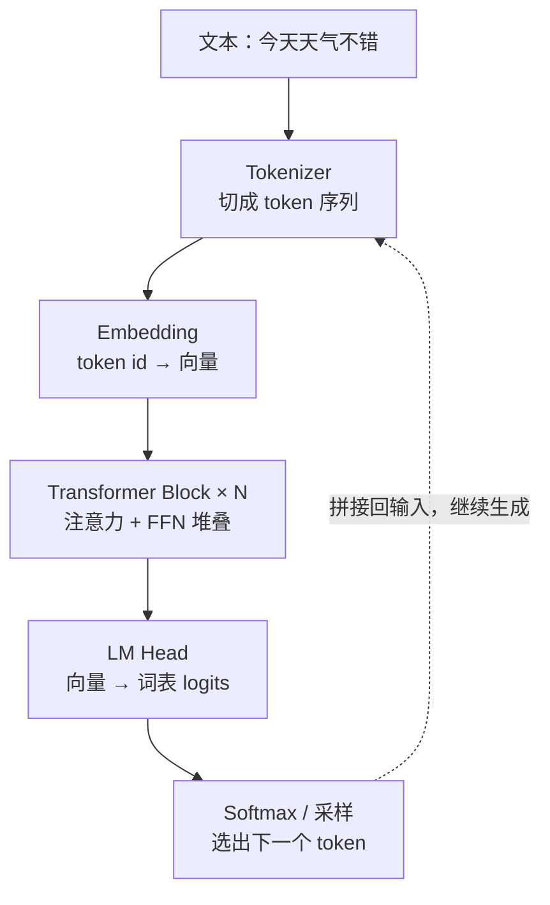
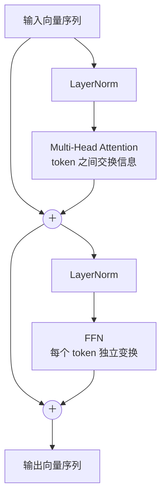
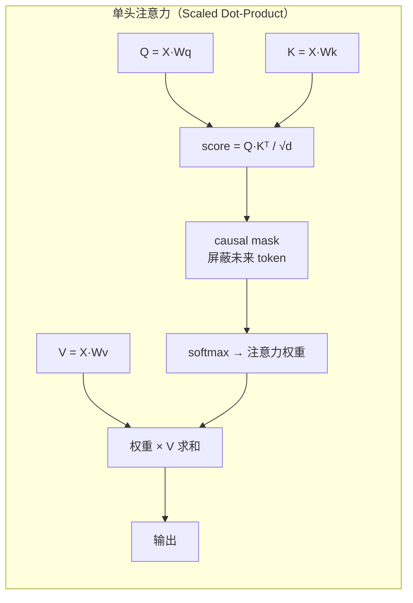
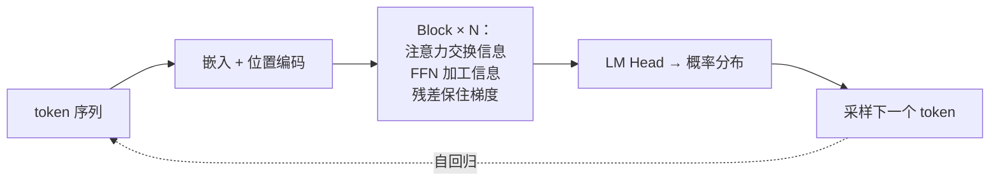

# Transformer 入门：从 Token 到注意力

Transformer 是当下所有大语言模型的骨架。它只做一件事：给一段 token 序列，预测下一个 token。本文把这件事拆开——从输入如何变成向量，到注意力如何在 token 之间传递信息，再到输出如何变回文字。

---

## 1. 整体结构

一个 Transformer 由三部分串联：**嵌入层**把 token 变成向量，**N 个相同的 Block** 反复加工这些向量，**输出头**把最终向量投影成词表上的概率分布。

每个 Block 内部结构固定不变，只是参数不同：

注意两条**残差旁路**（＋）：每个子层的输出都会加回输入。这让梯度可以跳过几十层直接回传，是深层网络能训起来的关键。

| 组件                 | 作用                                      | 是否跨 token   |
| -------------------- | ----------------------------------------- | -------------- |
| Multi-Head Attention | 让每个 token 看到其他 token，聚合上下文   | 是             |
| FFN（前馈网络）      | 对每个 token 独立做非线性变换，存储"知识" | 否             |
| LayerNorm            | 把向量数值归一化，稳定训练                | 否（逐 token） |
| 残差连接             | 输出 = 输入 + 子层结果，保证梯度通路      | —              |

## 2. 输入：Token 与位置

文本先被 tokenizer 切成 token（可能是字、子词或字节片段），每个 token 查表得到一个 d 维向量。但查表只告诉模型"这是什么"，没告诉它"在哪里"——注意力本身对顺序完全无感，打乱输入结果不变。

所以还要叠加**位置编码**：原论文用固定的正弦/余弦波形，现代模型多用可学习的位置向量或 RoPE（旋转位置编码，把位置信息编码为向量的旋转角，对相对位置更友好）。

| 方案           | 代表模型         | 特点                                 |
| -------------- | ---------------- | ------------------------------------ |
| 正弦位置编码   | 原始 Transformer | 固定、可外推到更长序列，但表达能力弱 |
| 可学习位置向量 | GPT-2            | 灵活，但训练多长的序列就只能用多长   |
| RoPE           | LLaMA、Qwen      | 相对位置编码，长度外推性好，当前主流 |

## 3. 注意力：信息的交换

注意力回答一个问题：**当前 token 应该从序列里哪些 token 取信息、各取多少？**

每个 token 的向量被投影成三个角色：

- **Q（Query）**：我在找什么
- **K（Key）**：我是什么
- **V（Value）**：我能提供什么

用 Q 与所有 K 做点积得到相关性分数，softmax 归一化成权重，再对 V 加权求和——这一步就是"读上下文"。

**多头**就是把这个过程并行做 h 份，每份在更小的子空间里学不同的关注模式（有的头盯语法、有的头盯指代），最后拼接投影回来。

**因果掩码（causal mask）** 是语言模型的关键约束：位置 i 只允许看到 ≤ i 的 token，不许偷看答案。它把分数矩阵的上三角置为 -∞，softmax 后权重为 0。

复杂度是注意力的阿喀琉斯之踵：序列长度为 n 时，score 矩阵是 n × n，显存和计算都按 **O(n²)** 增长。FlashAttention 通过分块计算把显存降到 O(n)，是今天长上下文训练的基础设施。

## 4. 输出：从向量回到文字

最后一层 Block 输出的向量经过 LayerNorm 和 LM Head（一个 d → 词表大小的线性层，常与嵌入矩阵共享参数），得到词表上每个 token 的 logits，softmax 后就是下一个 token 的概率分布。

| 解码策略      | 做法                                      | 效果                       |
| ------------- | ----------------------------------------- | -------------------------- |
| Greedy        | 每步取概率最大的 token                    | 确定、但容易重复、平庸     |
| Temperature   | logits 除以 T 再 softmax                  | T 大更随机，T 小更保守     |
| Top-k / Top-p | 只在概率最高的 k 个 / 累计 p 的集合里采样 | 截掉长尾，兼顾质量与多样性 |

生成是**自回归**的：选出的 token 拼回输入末尾，再走一遍整个模型得到下一个，直到遇到结束符。这也是为什么推理成本随输出长度线性增长。

## 5. 一图收尾

记住三句话就够入门了：**注意力负责 token 之间的交流，FFN 负责每个 token 自己的思考，残差和 LayerNorm 负责让几十层叠起来还能训练。** 其余一切——RoPE、GQA、MoE、FlashAttention——都是在这三个支柱上的工程优化。
