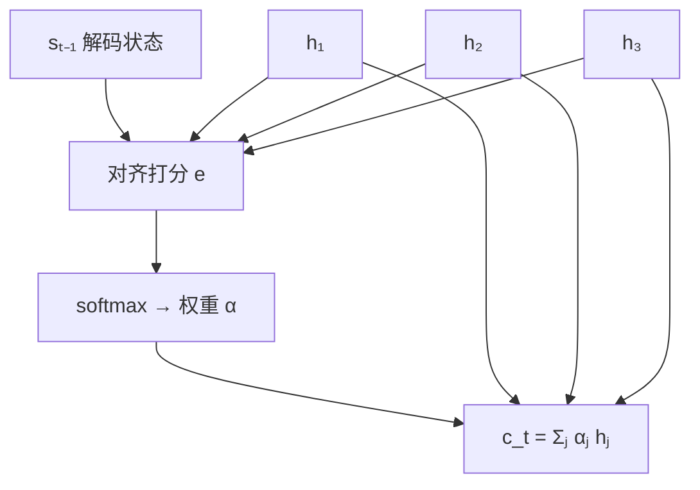

---
navigation:
  prev: sequence-modeling.md
  next: transformer-intro.md
---

# 注意力：可微的查表

上一篇结尾的瓶颈：decoder 能用的全部源句信息，只有 encoder 末隐状态那一个向量。Bahdanau 等（2015）的破解直白而深刻——别压了，**让解码的每一步回头查询源句的所有位置**。这个机制叫注意力，它先是补丁，然后成了主角，最终把整个 RNN 挤下了舞台。

## 从瓶颈里长出来的机制

encoder 照旧逐词产生隐状态 $h_1, \dots, h_n$，但不再只用最后一个。decoder 生成第 $t$ 个词时，拿当前状态 $s_{t-1}$ 与**每个**源位置算一个对齐分数，softmax 归一化成权重，再加权求和得到这一步专属的上下文向量：

$$
e_{tj} = a\left(s_{t-1},\, h_j\right), \qquad \alpha_{tj} = \mathrm{softmax}_j\left(e_{tj}\right), \qquad c_t = \sum_{j=1}^{n} \alpha_{tj}\, h_j
$$

$a$ 是一个小型打分网络。每个目标词各自决定"该看源句哪里"：生成"中文"时权重自然聚到源句开头的"中国"附近，瓶颈随之消失。

两个性质值得单独强调。其一，**全程可微**：打分、softmax、加权求和没有一处离散操作，梯度沿 $\alpha$ 流回每个 $h_j$——注意力不是"选中"某个位置，而是对每个位置"各取一点"，正因如此才能端到端训练。其二，$\alpha$ 天然**可解释**：把权重矩阵画出来，就是两种语言词与词的对齐图。网络的内部决策第一次变得可读。

## 抽象：Query、Key、Value

把上面的结构提炼成与 RNN 无关的通用操作。一次注意力涉及三种角色：

- **Query（查询）**：我现在要找什么；
- **Key（键）**：我标注了自己是什么——用来和查询比对的索引；
- **Value（值）**：我实际携带的内容——被选中后你能拿走的东西。

Bahdanau 的版本里，$s_{t-1}$ 是 query，每个 $h_j$ 同时充当 key 和 value。打分换成最简单的点积，就得到现代形态：

$$
\mathrm{Attention}(Q, K, V) = \mathrm{softmax}\!\left(\frac{Q K^\top}{\sqrt{d_k}}\right) V
$$

$Q, K, V$ 是按行堆叠的矩阵，一次矩阵乘算完所有查询。把它读成**可微的查表**最准确：硬查表用 argmax 选中一行，注意力把"选哪行"软化成"每行各取多少"——软，所以可微；可微，所以能学。

## 为什么除以 $\sqrt{d_k}$

设 $q, k$ 各分量独立、方差为 $1$，则点积 $q^\top k$ 的方差随维度 $d_k$ 线性增长。$d_k$ 一大，点积的绝对值动辄几十，softmax 被推到饱和区——权重近乎 one-hot，且梯度趋零（softmax 饱和时梯度消失的机制，和 sigmoid 一模一样）。除以 $\sqrt{d_k}$ 把方差拉回 $O(1)$，让 softmax 待在敏感区间。小小的缩放因子，是注意力在大维度下仍然可训练的关键。

## 自注意力：序列内部的互相查询

决定性的一步推广：让 $Q, K, V$ 来自**同一个序列**——三个可学投影 $XW_Q, XW_K, XW_V$。于是每个位置同时对其它所有位置做一次查询，一词多义由此可解："苹果"在"我吃苹果"与"苹果发布新手机"里，通过 attend 到不同的上下文词，得到不同的向量表示。

与 RNN 对比，结构性差异一目了然：

- **路径长度**：任意两个位置交换信息，RNN 要沿时间链传 $O(n)$ 步，梯度在途中衰减；自注意力**一步直达**，长程依赖的梯度路径降到 $O(1)$——上一篇的病灶在结构上被切除。
- **并行性**：RNN 的第 $t$ 步必须等第 $t-1$ 步算完；自注意力的全部 $QK^\top$ 是一次大矩阵乘，所有位置同时算——GPU 求之不得。
- **代价一**：两两交互意味着 $O(n^2)$ 的计算与显存，长序列昂贵。
- **代价二**：点积对位置不敏感——打乱词序，注意力结果原样重排。模型是**置换不变的**，顺序信息丢了，必须另外注入。

这两条代价不是缺陷清单，而是下一篇的两块拼图：位置编码补回顺序，而 $O(n^2)$ 将在 Transformer 系列里引出整整一支效率优化的研究。

## 小结

- 注意力起于打破 encoder–decoder 瓶颈：解码时对全部源位置做软查询，瓶颈消失，且全程可微、权重可解释。
- Q/K/V 抽象：query 提问、key 索引、value 内容；$\mathrm{softmax}(QK^\top / \sqrt{d_k})\,V$ 就是可微查表，缩放因子防止 softmax 饱和。
- 自注意力让序列内部任意位置一步直达、全并行，代价是 $O(n^2)$ 与顺序感的丢失。
- 既然注意力自己就能建模序列——还要 RNN 干什么？下一篇给出回答：不要了。Transformer。
