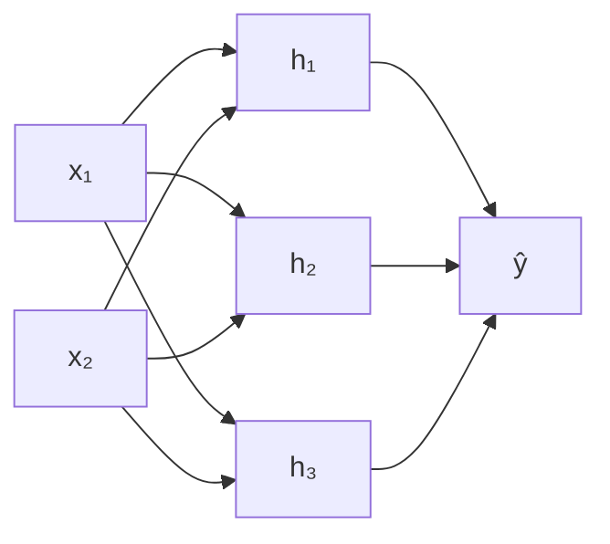

---
navigation:
  prev: perceptron.md
  next: optimization.md
---

# 多层感知机：把误差传回去

上一篇留下了一个悬而未决的问题：两条直线可以拼出 XOR，但感知机的学习规则只适用于最后一层——中间层的参数没有"正确答案"可对，错误无从归因。这篇给出解决方案，它分两步：先把硬阈值磨光滑，让"误差"有梯度可谈；再用**反向传播**把误差的敏感度从输出层逐层传回，每个参数各领一份责任。

## 第一步：把硬台阶磨光滑

感知机的激活函数是符号函数 $\mathrm{sign}(z)$——一个台阶。它有两个致命伤：在 $z = 0$ 处不可导，在其余地方导数恒为零。梯度不存在的意思是：你稍微改动参数，输出要么纹丝不动，要么跳变，"改多少能变好"这个问题根本无法用微积分回答。

所以第一步是把台阶换成光滑（或几乎光滑）的曲线。常见的选择：

| 激活函数 | 定义 | 导数 |
| -------- | ---- | ---- |
| sigmoid | $\sigma(z) = \dfrac{1}{1 + e^{-z}}$ | $\sigma(z)\bigl(1 - \sigma(z)\bigr)$ |
| tanh | $\tanh(z)$ | $1 - \tanh^2(z)$ |
| ReLU | $\max(0, z)$ | $z > 0$ 时为 $1$，$z < 0$ 时为 $0$ |

要求的只有一件事：**（几乎）处处可微，且导数好算**。sigmoid 的导数能用自身表出，代码里一次前向的产出直接复用；ReLU 在 $z=0$ 处严格说不可导，实践里随意取 $0$ 或 $1$ 即可，无碍训练。

还有一个更基本的问题：为什么要非线性？如果激活是恒等函数，两层网络 $W_2(W_1 x) = (W_2 W_1) x$ 仍然是一个线性映射——**没有非线性，堆多少层都等价于单层**。非线性激活才是"堆叠"产生新表达能力的原因。

## 网络结构与记号

一个 $L$ 层的多层感知机（MLP），记号如下：输入 $a^{(0)} = x$，对第 $l = 1, \dots, L$ 层：

$$
z^{(l)} = W^{(l)} a^{(l-1)} + b^{(l)}, \qquad a^{(l)} = \sigma\!\left(z^{(l)}\right)
$$

$z^{(l)}$ 叫**预激活**（pre-activation），$a^{(l)}$ 是这一层的输出，$a^{(L)}$ 就是整个网络的预测 $\hat{y}$。一个两层（一隐层）的网络长这样：



最后一层是"任务层"，它的形状由任务决定：回归直接输出 $z^{(L)}$，二分类过 sigmoid，多分类过 softmax。训练的目标是最小化损失函数在所有样本上的平均（经验风险），例如平方损失 $L = \frac{1}{2}\|\hat{y} - y\|^2$ 或交叉熵。本篇不纠结具体选哪个，只需要 $L$ 对 $\hat{y}$ 可微。

隐藏层的表达能力有多强？Cybenko（1989）证明：单隐层、sigmoid 激活的网络，只要隐藏单元足够多，就能以任意精度逼近紧集上的任意连续函数（万能近似定理）。所以问题从来不是"能不能表达"，而是"参数怎么找"——这正是反向传播要回答的。

## 反向传播：链式法则的递推

训练需要 $L$ 对每个参数 $W^{(l)}, b^{(l)}$ 的梯度。直接对每个参数写链式法则会写出一大堆重复的路径求和；反向传播的洞察是：**定义一个中间量，让递推自己走出来**。

定义第 $l$ 层的**误差信号**为损失对预激活的敏感度：

$$
\delta^{(l)} = \frac{\partial L}{\partial z^{(l)}}
$$

$\delta^{(l)}$ 读作：$z^{(l)}$ 里每个分量如果动一动，损失会怎么变。它就是感知机里"正确答案"的替代品——隐藏单元没有标准答案，但有**责任大小**，而责任可以从唯一有监督信号的地方（输出层）传回来。

**输出层**的误差信号直接算：

$$
\delta^{(L)} = \nabla_{a^{(L)}} L \;\odot\; \sigma'\!\left(z^{(L)}\right)
$$

$\odot$ 是逐元素乘法。以平方损失为例，$\nabla_{a^{(L)}} L = \hat{y} - y$，就是预测与标签之差。

**递推**：因为 $z^{(l+1)} = W^{(l+1)} \sigma\!\left(z^{(l)}\right) + b^{(l+1)}$，对 $z^{(l)}$ 用一次链式法则：

$$
\delta^{(l)} = \left(W^{(l+1)}\right)^{\!\top} \delta^{(l+1)} \;\odot\; \sigma'\!\left(z^{(l)}\right)
$$

这一行就是全部：把下一层的误差信号用权重矩阵**转置**乘回来，再乘上本层激活的导数。前向时信息沿 $W$ 流动，反向时误差沿 $W^\top$ 流回——方向相反，用的是同一张网。

**参数梯度**随 $\delta$ 免费得到：

$$
\frac{\partial L}{\partial W^{(l)}} = \delta^{(l)} \left(a^{(l-1)}\right)^{\!\top}, \qquad \frac{\partial L}{\partial b^{(l)}} = \delta^{(l)}
$$

每个权重 $W^{(l)}_{jk}$ 的梯度 = 它下游神经元的误差信号 $\delta^{(l)}_j$ × 它上游的输入 $a^{(l-1)}_k$。"责任 × 输入"，这和感知机规则 $w \leftarrow w + \eta\, y_i x_i$ 的形状如出一辙——不是巧合，最后会点明。

整个算法就是一次前向加一次反向：

```python
# 前向：逐层算 z 和 a，沿途缓存
a = x
for l in range(1, L + 1):
    z[l] = W[l] @ a + b[l]
    a = A[l] = act(z[l])

# 反向：从输出层的 δ 出发逐层传回
d = dLoss(A[L], y) * act_grad(z[L])          # δ⁽ᴸ⁾
for l in range(L, 0, -1):
    gW[l], gb[l] = d @ A[l-1].T, d           # 参数梯度
    if l > 1:
        d = (W[l].T @ d) * act_grad(z[l-1])  # δ⁽ˡ⁻¹⁾
```

这套推导由 Rumelhart、Hinton 与 Williams（1986）推广开来，成为训练一切神经网络的标配。注意到 $W^{(l)}$ 是矩阵、$a^{(l)}$ 是向量，把一批样本按列堆进矩阵，所有公式原样成立——向量化是免费的。

## 参数更新：与感知机规则重逢

拿到梯度后就是最朴素的梯度下降：$W^{(l)} \leftarrow W^{(l)} - \eta\, \partial L / \partial W^{(l)}$。

回头看感知机。取损失 $L(w) = \max\bigl(0, -y_i\, w^\top x_i\bigr)$——分错（或压在面上）时损失正比于"差多少分对"，分对时为零。它在分错处的次梯度是 $-y_i x_i$，一步随机梯度下降给出：

$$
w \leftarrow w - \eta\,(-y_i x_i) = w + \eta\, y_i x_i
$$

正是感知机的更新规则。**感知机规则不是凭空的设计，而是这个铰链形损失上的梯度下降**——只是 sign 激活挡住了视线，让它看起来像一个离散的纠错技巧。换上光滑激活、允许多层之后，同一条"沿梯度走"的路就贯通到了每一层。

## XOR 的收尾

回到上一篇的 XOR：两层网络不仅*能*表达它（手工构造已验证），现在还能*学*出来——损失对隐藏层参数有了定义良好的梯度，剩下的交给迭代。几何上的读法也更清晰了：第一层画出几条直线，把输入映射到"各条线输出"张成的新空间；第二层在这个新空间里做一次线性分割。**隐藏层是在学一个让问题变得线性可分的表示**——这个视角会一直延伸到很深的网络。

## 小结

- 硬阈值换成可微激活，误差才有梯度可言；没有非线性，多层等价于单层。
- 万能近似定理保证表达能力不构成瓶颈，真正的难题是求参数。
- 反向传播 = 链式法则 + 误差信号 $\delta^{(l)} = \partial L / \partial z^{(l)}$ 的递推：输出层直接算，逐层用 $\left(W^{(l+1)}\right)^{\top} \delta^{(l+1)} \odot \sigma'(z^{(l)})$ 传回，参数梯度 = 下游误差信号 × 上游激活。
- 感知机规则是铰链损失上的梯度下降；反向传播把同一条原则推广到了任意深度。
- 留下的问题：学习率怎么选、损失函数怎么配、层数加深后梯度为何会消失或爆炸——这是下一篇的主题。
