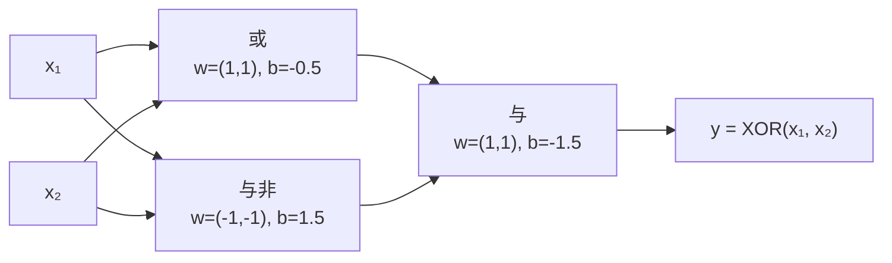

---
navigation:
  next: multilayer-perceptron.md
---

# 感知机：一切从一条直线开始

神经网络的历史可以追溯到 1958 年 Rosenblatt 提出的感知机（perceptron）。它的结构简单到近乎简陋，却包含了后来所有神经网络的三个核心要素：**参数化的假设、错误驱动的学习规则、以及"表达能力不够就堆叠"的出路**。把感知机彻底想清楚，后面的多层网络、反向传播都是自然延伸。

## 问题：二分类

给定样本 $(x_i, y_i)$，其中 $x_i \in \mathbb{R}^d$ 是特征向量，$y_i \in \{+1, -1\}$ 是类别标签。我们想找一个规则，对新的 $x$ 预测它的类别。

最朴素的想法：用一条直线（高维中是超平面）把两类点分开。超平面由法向量 $w \in \mathbb{R}^d$ 和偏置 $b \in \mathbb{R}$ 决定：

$$
f(x) = \mathrm{sign}(w^\top x + b)
$$

$w^\top x + b = 0$ 是分割面本身；$w^\top x + b$ 的符号表示点落在面的哪一侧，绝对值正比于点到面的距离。这个"距离即置信度"的读法后面会反复用到。

把偏置吸收进向量——令 $\tilde{x} = (x, 1)$，$\tilde{w} = (w, b)$——模型就只剩一个内积 $f(x) = \mathrm{sign}(\tilde{w}^\top \tilde{x})$。以下推导省略波浪号，记住 $b$ 一直在里面。

## 学习规则：哪里错了往哪改

感知机的学习算法异常直白：遍历样本，遇到一个分错的就调整一次参数：

$$
w \leftarrow w + \eta\, y_i x_i \quad \text{当 } y_i (w^\top x_i) \le 0
$$

其中 $\eta > 0$ 是学习率。注意 $y_i (w^\top x_i) \le 0$ 正是"分错"的代数表达：预测符号与真实标签不一致（或恰好压在面上）。

为什么这个更新方向是对的？看更新前后同一个样本的得分变化：

$$
y_i (w + \eta y_i x_i)^\top x_i = y_i w^\top x_i + \eta\, y_i^2 \|x_i\|^2 = y_i w^\top x_i + \eta \|x_i\|^2
$$

分错的样本，更新后它的"带符号距离"严格增大了 $\eta \|x_i\|^2$——朝正确的方向迈了一步。每一步都在局部改善，这就是"错误驱动"的含义。

## 收敛性：可分就一定能学会

这个算法会不会无限震荡下去？Novikoff 定理（1962）给出了否定答案：

> 若数据**线性可分**——存在单位向量 $w^*$ 和间隔 $\gamma > 0$，使所有样本满足 $y_i (w^{*\top} x_i) \ge \gamma$，且样本模长有上界 $\|x_i\| \le R$——那么感知机算法至多犯错 $(R/\gamma)^2$ 次后停止。

证明只需跟踪两个量：$w$ 与 $w^*$ 的夹角余弦。每次犯错让 $w^\top w^*$ 至少增加 $\eta\gamma$，而 $\|w\|$ 至多按 $\eta R$ 的速率增长，两者一除便夹出了犯错次数的上界。间隔 $\gamma$ 越大（数据分得越开），收敛越快——几何直觉与定理完全对应。

但注意前提：**线性可分**。这是感知机的阿喀琉斯之踵。

## 局限：XOR 问题

Minsky 与 Papert 在 1969 年指出，感知机连异或（XOR）都学不了：

| $x_1$ | $x_2$ | $y$ |
| ----- | ----- | --- |
| 0     | 0     | −1  |
| 0     | 1     | +1  |
| 1     | 0     | +1  |
| 1     | 1     | −1  |

四个点中，同类点位于对角——平面上不存在任何一条直线能把 $+1$ 和 $-1$ 分开。代数上看，四个约束要求 $w_1 + w_2 + b < 0$ 而 $w_1 + b > 0$、$w_2 + b > 0$、$b < 0$，相加即得矛盾。

这个结论一度让神经网络研究陷入低谷。但出路就藏在问题里：**一条直线不够，就用两条**。XOR 可以拆成"或"与"与非"的与——每个子问题都线性可分，再组合它们的输出：

第一层画出两条直线，第二层对它们的输出再做一次线性分割。XOR 立刻可分——但代价是网络变成了两层，而感知机的学习规则只适用于最后一层：**中间层的参数没有"正确答案"可对，错误无从归因**。如何解决多层网络的训练，正是下一篇的主题。

## 小结

- 感知机 = 线性分割面 + 符号函数，$f(x) = \mathrm{sign}(w^\top x + b)$。
- 学习规则是错误驱动的：分错就沿 $y_i x_i$ 方向调整，每次更新让该样本的带符号距离增大 $\eta\|x_i\|^2$。
- 数据线性可分时，$(R/\gamma)^2$ 次犯错内必然收敛；不可分则算法永不停止。
- XOR 暴露了单层线性的表达极限，而"堆叠"的解法引出了真正的难题：多层网络怎么训练。
