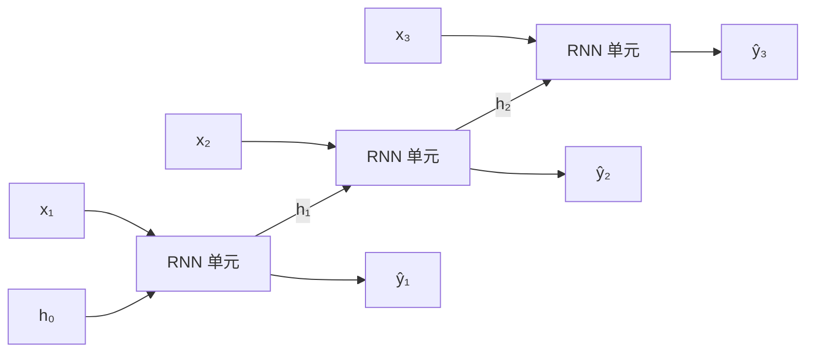

---
navigation:
  prev: training-deep-networks.md
  next: attention.md
---

# 序列建模：RNN 与它的记忆瓶颈

到目前为止，输入都是一个定长向量。但文本、语音、股价这类数据是**变长序列**，顺序本身携带信息——"我打他"和"他打我"是同一袋词，意思相反。MLP 处理不了它：截断填充成定长会丢词序，给每个位置单独学参数则长度一变就废。序列模型需要两条新性质：**接受任意长度**，以及**参数沿位置共享**——同一个"阅读器"在每个位置复用，而不是每个位置一套新参数。

## RNN：把状态传下去

循环神经网络（RNN）的答案是维护一个隐状态 $h_t$，作为到时刻 $t$ 为止全部历史的压缩摘要：

$$
h_t = \sigma\left(W_h h_{t-1} + W_x x_t + b\right), \qquad \hat{y}_t = \mathrm{softmax}\left(W_y h_t\right)
$$

每个时间步读入一个词 $x_t$，把旧摘要 $h_{t-1}$ 更新成新摘要。同一组参数 $(W_h, W_x, W_y)$ 在所有时刻复用——参数量与序列长度无关，变长问题随之消失。沿时间展开看，结构一目了然：

注意图中的三个"RNN 单元"是**同一组权重的三次复用**，不是三个不同的模块——这正是"循环"二字的含义。

## 训练：沿时间反向传播

展开图同时揭示了训练方法：它就是一个"$T$ 层、各层共享权重"的深网络。反向传播照常沿计算图走——梯度从各时刻的损失沿 $h$ 的链条传回去，同一参数在不同时刻收到的梯度求和即为总梯度。这套做法叫沿时间反向传播（BPTT），本质仍是链式法则，没有新东西。

但代价立刻可见。梯度每跨过一个时间步，都要乘一次 $W_h^\top$ 再乘一次 $\sigma'$，$T$ 步就是**同一个矩阵的 $T$ 次连乘**。上一篇的消失/爆炸问题在时间维度重演，而且更加极端：矩阵连乘 $T$ 次的行为由最大特征值主导——小于 $1$ 就压成零，大于 $1$ 就炸上天，几乎没有稳定中间态。这是 RNN 的结构性病灶，不是调参能绕开的。

## 后果：长期依赖学不到

看一个具体例子："我出生在中国，小时候随家人搬了几个城市，……（一百个词之后）……我的母语是____。"要填出"中文"，模型必须记住一百步之前的信息。而梯度从句尾传回句首，要穿过整条时间链——传到地方时早已衰减殆尽。RNN 的记忆**理论上无限，实际上有效记忆只有几十步**。

## LSTM：给记忆开一条加法通道

LSTM（1997）的核心改动，是把状态更新从"乘法式"改成"加法式"。它引入一条独立的记忆细胞 $c_t$，更新规则形如：

$$
c_t = f_t \odot c_{t-1} + i_t \odot \tilde{c}_t
$$

$f_t$（遗忘门）、$i_t$（输入门）都是 $0$ 到 $1$ 之间的门控向量，由当前输入与旧状态算出，逐项决定"忘掉多少旧记忆、写入多少新内容"；另有一个输出门控制从记忆里读多少到 $h_t$。关键在于梯度沿 $c$ 的通路以**加法**为主，只被接近 $1$ 的遗忘门逐元素缩放——连乘被拆成了连加，消失大为缓解。GRU（2014）把三个门精简成两个，效果相当、更便宜。

这些公式细节不必死记，要带走的是思想：**用门控的加性通路保护长程梯度**。它和上一篇残差连接的"+ $x$"是同一个直觉。

## encoder–decoder：范式与瓶颈

机器翻译塑造了后来一切序列生成的范式：一个 encoder RNN 读完整句源文，把**末隐状态**——一个定长向量——交给 decoder RNN，逐词生成译文。优雅、通用，但埋着一个结构性瓶颈：**整个源句的信息必须挤进这一个向量**。句子越长，挤压越致命。LSTM 缓解的是梯度消失，对这个"一个向量装一句话"的瓶颈无能为力。

## 小结

- RNN 用共享权重 + 递推隐状态处理变长序列；BPTT 把训练化为沿时间的反向传播。
- 同一矩阵沿时间连乘，长期依赖处的梯度几乎必然消失；LSTM/GRU 用门控加法通道缓解，与残差连接同一直觉。
- encoder–decoder 把整句压成一个定长向量，信息瓶颈随句子变长而致命。
- 如果解码时不必只盯着这个向量，而是能回头**逐个查询**源句的每个位置呢？——下一篇，注意力。
