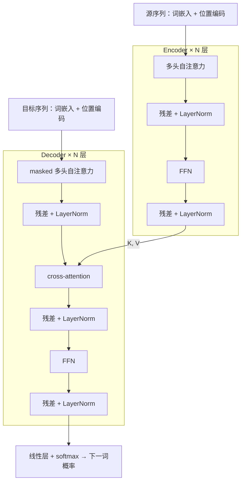

---
navigation:
  prev: attention.md
---

# Transformer 入门：注意力就是全部

2017 年的论文 _Attention Is All You Need_ 做了一件激进的事：把 RNN 整个扔掉，只留注意力与前馈网络。这个决定同时兑现了上一篇的两条红利——任意位置一步直达、训练全并行；剩下的两条代价（没有顺序感、$O(n^2)$），一个用位置编码补上，一个留待后人优化。这篇把整张架构图走一遍。它是本系列的终点，也是下一个系列的起点。

## 全景

Transformer 最初是为机器翻译设计的，仍是 encoder–decoder 结构，但每一层内部焕然一新：

逐块拆开看，每一块都是前几篇的老朋友。

## 位置编码：把顺序注入进来

自注意力对输入置换不变，顺序必须显式注入。原论文用正弦编码：位置 $pos$ 的编码向量，第 $2i$ 与 $2i+1$ 维分别是

$$
\mathrm{PE}_{(pos,\, 2i)} = \sin\!\left(\frac{pos}{10000^{2i/d}}\right), \qquad \mathrm{PE}_{(pos,\, 2i+1)} = \cos\!\left(\frac{pos}{10000^{2i/d}}\right)
$$

不同维度是不同频率的"时钟"，低频维度走得慢、高频维度走得快，合起来唯一标记每个位置；且任意相对偏移 $pos + k$ 的编码是 $pos$ 编码的线性函数，便于模型利用相对位置。实践中许多模型直接**学**一张位置嵌入表，和词嵌入一样查表。两种方式都是把位置向量**加**在词向量上——信息是注入，不是拼接。

## 多头注意力：多组视角并行

一组 $Q, K, V$ 只能在一个表示空间里算一种相似度。多头把 $d$ 维切成 $h$ 份，每份独立做一遍注意力，再拼接投影：

$$
\mathrm{head}_i = \mathrm{Attention}\left(XW_i^Q,\, XW_i^K,\, XW_i^V\right), \qquad \mathrm{MultiHead}(X) = \mathrm{Concat}\left(\mathrm{head}_1, \dots, \mathrm{head}_h\right) W^O
$$

直觉：不同的头学会关注不同关系——有的盯句法依存，有的盯指代，有的只看相邻位置——类似 CNN 里多个卷积核各看一种模式。因为维度被切分，总计算量与单头大体相当，相当于免费获得多组视角。

## 前馈网络与残差骨架

注意力负责"位置之间混合信息"，但每个位置内部的表示还需要被变换。前馈网络（FFN）对**每个位置独立地**施加同一个两层 MLP：

$$
\mathrm{FFN}(x) = W_2\, \sigma\left(W_1 x\right)
$$

隐藏维通常扩到 $4d$。注意力管混合，FFN 管变换，两者分工明确、交替堆叠。

每个子层（注意力或 FFN）外面包着同一副骨架：$\mathrm{LayerNorm}\bigl(x + \mathrm{Sublayer}(x)\bigr)$。这正是《深层的代价》那篇埋下的两条线在此收拢——残差连接给梯度开直达通路，让几十层堆叠可训练；LayerNorm 逐样本稳住分布。原论文把 LayerNorm 放在残差之后（post-norm），后来的实践普遍移到子层之前（pre-norm），训练更稳，这类细节留给 Transformer 系列。

## decoder 的两处不同

decoder 与 encoder 结构对称，只有两处关键修改：

- **masked 自注意力**：生成第 $t$ 个词时不许偷看答案。做法优雅到近乎免费——把 $QK^\top$ 上三角（未来位置）置为 $-\infty$ 再 softmax，那些位置的权重精确归零。注意力的"软选择"天然支持屏蔽，一行掩码即可。
- **cross-attention**：$Q$ 来自 decoder，$K, V$ 来自 encoder 的最终输出。这就是 Bahdanau 注意力的直系后代——每个目标位置查询整个源序列，只是打分从一个小网络换成了缩放点积。

## 一次前向的形状走查

设序列长 $n$、表示维度 $d$。输入是 $n \times d$ 的矩阵 $X$；自注意力的 $QK^\top$ 是 $n \times n$——**平方复杂度就出现在这一个矩阵上**，参数量却与 $n$ 无关，序列长度只影响计算量和显存；FFN 与所有投影都是 $n \times d$ 进、$n \times d$ 出。整个网络就是同一种形状的张量反复流过"混合 → 变换"两种操作，干净到可以一路堆到几十上百层。

## 为什么它赢了

- **并行**：训练时整句的所有位置一起算，RNN 的串行瓶颈消失——同样的算力能喂大几个数量级的数据。
- **长程**：任意两个位置一步直达，长文本建模第一次变得可行。
- **可扩展**：架构单调干净——堆层、加宽、加数据，性能持续而可预测地上涨。后来的 scaling law 研究正是建立在这份单调之上：GPT 系列证明，把 decoder-only 的 Transformer 放大，本身就是通向通用能力的路。

## 小结与本系列终点

- Transformer = 位置编码 + 多头自注意力 + 逐位置 FFN，每个子层包在残差 + LayerNorm 里；decoder 额外有 masked 自注意力与 cross-attention。
- 它兑现了注意力的结构红利（长程 $O(1)$、训练全并行），用位置编码补回顺序，把 $O(n^2)$ 留作开放问题。
- 从感知机到这里，神经网络通用基础这条线走完了：线性模型 → 反向传播 → 优化与深层训练 → 序列 → 注意力 → Transformer。
- Transformer 自身的深水区——decoder-only 与生成式预训练、位置编码的演进、注意力的高效变体、如何训练出 LLM——从下一个系列开始。
